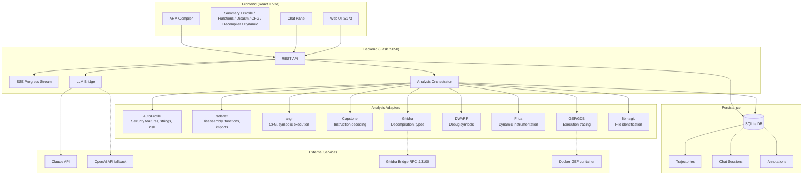

# r2d2

**Learn ARM Reverse Engineering with AI** — A production-ready binary analysis copilot that pairs fast local tooling with Claude-powered insights. Perfect for learning ARM assembly, CTF challenges, malware analysis, and understanding how programs work at the machine level.

## Why r2d2?

Reverse engineering is hard. You need to juggle multiple tools (disassemblers, decompilers, debuggers), understand complex file formats, and interpret low-level assembly—all while trying to answer high-level questions like "what does this malware do?" or "where's the vulnerability?"

**r2d2 solves this by:**

1. **Unified Tool Orchestration**: Instead of manually running radare2, Ghidra, angr, and GDB separately, r2d2 orchestrates them automatically and presents unified results.

2. **AI-Powered Understanding**: Claude explains assembly code in plain English, identifies patterns, and helps you understand what you're looking at. The LLM has full context of the analysis—functions, strings, security features, CFG—so its answers are grounded in actual data.

3. **Learning-Focused Design**: Hover over any instruction for documentation. Select code and ask "what does this do?" Annotations persist so you can build understanding over time. Perfect for learning ARM assembly.

4. **Multiple Representation Levels**: See your code as C source, assembly, and machine bytes. Understand the transformation pipeline from high-level to low-level.

5. **Trajectory Recording**: Every analysis step is recorded to SQLite. Replay sessions, audit decisions, and build training data for future automation.

## System Architecture



## Key Features

### Multi-Tool Analysis Pipeline
| Tool | Purpose | Output |
|------|---------|--------|
| **AutoProfile** | Quick binary characterization | Security features (NX, PIE, RELRO), interesting strings, risk assessment |
| **radare2** | Primary disassembler | Functions, imports, strings, disassembly, binary metadata |
| **angr** | Symbolic execution | Control Flow Graphs (CFG), reachability analysis, path constraints |
| **Capstone** | Instruction decoding | Detailed operand information for each instruction |
| **Ghidra** | Decompilation | C-like pseudocode, type recovery, cross-references |
| **DWARF** | Debug info parsing | Source symbols, type definitions, line mappings |
| **Frida** | Dynamic instrumentation | Runtime module info, memory layout, hook points |
| **GEF/GDB** | Execution tracing | Register snapshots, memory maps, instruction traces |
| **libmagic** | File identification | File type, MIME type, encoding |

### Interactive Web UI
- **Disassembly View**: Syntax highlighting, instruction hover docs, drag-to-select, annotations
- **CFG Explorer**: Visual control flow graphs with function navigation
- **Decompiler Panel**: Ghidra-powered C pseudocode with "Ask Claude" integration
- **Dynamic Analysis**: GEF execution traces with register timeline
- **ARM Compiler**: Write C, compile to ARM, see assembly (Godbolt-style)
- **Chat Panel**: Claude conversation with full analysis context

### AI Integration
- **Claude-powered analysis** with automatic fallback to OpenAI
- **Context-aware responses**: LLM sees functions, strings, security features, disassembly
- **Activity tracking**: LLM knows what you've been exploring for relevant answers
- **Trajectory recording**: Every analysis step is logged for reproducibility

## Full Setup Guide

### Prerequisites

```bash
# System dependencies
sudo apt-get update
sudo apt-get install -y radare2 libmagic-dev python3.11 python3.11-venv docker.io

# Install uv (Python package manager)
curl -LsSf https://astral.sh/uv/install.sh | sh
source ~/.bashrc

# Install Node.js 18+ (for frontend)
curl -fsSL https://deb.nodesource.com/setup_18.x | sudo -E bash -
sudo apt-get install -y nodejs
```

### Step 1: Clone and Configure

```bash
git clone https://github.com/your-org/r2d2.git
cd r2d2

# Set up environment variables
cp .env.example .env
# Edit .env and add your API key:
#   ANTHROPIC_API_KEY=sk-ant-...
```

### Step 2: Install Python Dependencies

```bash
# Install all dependencies including analyzers
uv sync --extra analyzers

# Verify installation
uv run r2d2 env
```

### Step 3: Install Frontend

```bash
cd web/frontend
npm install
cd ../..
```

### Step 4: Configure Ghidra (Optional but Recommended)

Ghidra provides decompilation, type recovery, and cross-references. r2d2 supports two modes:

**Headless Mode (Default)** - Runs `analyzeHeadless` subprocess:
```bash
# Download Ghidra 12.x from https://ghidra-sre.org/
# Extract to your preferred location

# Set environment variable in your .env or shell:
export GHIDRA_INSTALL_DIR=/path/to/ghidra_12.0.1_PUBLIC
export JAVA_HOME=/path/to/jdk-21  # Ghidra 12 requires Java 21

# The R2D2Headless.java script outputs JSON with functions, strings, 
# and decompiled code. It's automatically copied to ~/ghidra_scripts/
```

**Bridge Mode (Richer Data)** - Connects to running Ghidra GUI:
```bash
# 1. Install ghidra_bridge: pip install ghidra_bridge
# 2. Copy server script to ~/ghidra_scripts/:
cp .venv/lib/python*/site-packages/ghidra_bridge/server/*.py ~/ghidra_scripts/

# 3. Start Ghidra GUI and load your binary
# 4. In Ghidra: Window → Script Manager → Add ~/ghidra_scripts
# 5. Run: ghidra_bridge_server_background.py
# 6. Bridge listens on port 13100
```

> ⚠️ **PyGhidra Note**: PyGhidra 3.0.2 has a recursion bug with Python 3.11 when calling `pyghidra.start()` directly. The bug is in `_GhidraBundleFinder.find_spec()` which triggers infinite recursion during import. r2d2 uses `analyzeHeadless` subprocess instead, which works correctly. See [PyGhidra README](https://github.com/NationalSecurityAgency/ghidra/blob/master/Ghidra/Features/PyGhidra/src/main/py/README.md) for the official launcher approach.

### Step 5: Build GEF Docker Image (Optional)

```bash
# For dynamic analysis with execution tracing
docker build -t r2d2-gef -f Dockerfile.gef .
```

### Step 6: Install Frida (Optional)

```bash
# For dynamic instrumentation
pip install frida frida-tools
```

### Step 7: Run the Application

**Terminal 1 - Backend:**
```bash
uv run r2d2-web
# Flask API running on http://127.0.0.1:5050
```

**Terminal 2 - Frontend:**
```bash
cd web/frontend
npm run dev
# Vite dev server on http://localhost:5173
```

Open http://localhost:5173 in your browser.

### Verification

```bash
# Check all tools are detected
uv run r2d2 env

# Test Ghidra bridge (if configured)
python scripts/test_ghidra_bridge.py

# Run quick analysis on a sample
uv run r2d2 analyze samples/bin/arm64/hello --quick
```

## Usage Examples

### CLI Analysis

```bash
# Quick scan (fast, basic info)
uv run r2d2 analyze binary.elf --quick

# Full analysis (includes CFG, deeper disassembly)
uv run r2d2 analyze binary.elf

# JSON output for scripting
uv run r2d2 analyze binary.elf --json

# Ask Claude about the binary
uv run r2d2 analyze binary.elf --ask "What does this binary do?"

# Check environment
uv run r2d2 env
```

### Web UI Workflow

1. **Upload binary**: Drag and drop or click to browse
2. **Click Analyze**: Watch progress in the Logs tab
3. **Explore Results**:
   - Summary: Overview with tool attribution
   - Profile: Security features, risk assessment
   - Disasm: Interactive disassembly with annotations
   - CFG: Control flow graph visualization
   - Decompiler: C pseudocode (requires Ghidra)
4. **Ask Claude**: Select code → "Ask Claude" or use the Chat tab
5. **Annotate**: Click any instruction to add notes

### Compile and Analyze C Code

1. Go to the **Compiler** tab
2. Write or paste C code
3. Select architecture (ARM32/ARM64)
4. Click **Compile** to see assembly output
5. Click **Analyze & Chat** to analyze the compiled binary

## Configuration

Configuration is loaded from `config/default_config.toml`. Machine-specific paths should be set via environment variables (in `.env` or shell).

### Key Settings

```toml
[analysis]
enable_angr = true      # Symbolic execution and CFG
enable_ghidra = true    # Decompilation (requires Ghidra)
enable_frida = true     # Dynamic instrumentation
enable_gef = true       # GDB execution tracing (requires Docker)
timeout_deep = 120      # Seconds for deep analysis stage

[ghidra]
use_bridge = true       # Use Ghidra bridge for richer data (if available)
bridge_host = "127.0.0.1"
bridge_port = 13100
# install_dir set via GHIDRA_INSTALL_DIR env var

[llm]
provider = "anthropic"
model = "claude-sonnet-4-5"
```

### Environment Variables

```bash
# Required
ANTHROPIC_API_KEY=sk-ant-...        # Required for Claude

# Optional
OPENAI_API_KEY=sk-...               # Fallback LLM provider
GHIDRA_INSTALL_DIR=/path/to/ghidra  # Path to Ghidra installation
JAVA_HOME=/path/to/jdk-21           # Required for Ghidra 12+
R2D2_DEBUG=true                     # Enable debug logging
R2D2_CONFIG=/path/to/config.toml    # Custom config file path
```

## Project Structure

```
r2d2/
├── src/r2d2/
│   ├── adapters/           # Tool adapters (radare2, angr, ghidra, etc.)
│   ├── analysis/           # Orchestrator and resource tree
│   ├── llm/                # Claude/OpenAI integration
│   ├── storage/            # SQLite persistence
│   ├── web/                # Flask API
│   └── cli.py              # Typer CLI
├── web/frontend/           # React + Vite + MUI
├── config/                 # Default configuration
├── samples/                # Sample binaries and C source
├── scripts/                # Setup and utility scripts
└── tests/                  # pytest test suite
```

## Troubleshooting

### "radare2 not found"
```bash
sudo apt-get install radare2
# or on macOS: brew install radare2
```

### "angr import errors"
```bash
uv sync --extra analyzers
```

### "Ghidra not ready" / "analyzeHeadless not found"
```bash
# Ensure GHIDRA_INSTALL_DIR is set
export GHIDRA_INSTALL_DIR=/path/to/ghidra_12.0.1_PUBLIC

# Verify the script exists
ls $GHIDRA_INSTALL_DIR/support/analyzeHeadless

# For Ghidra 12+, ensure Java 21 is available
export JAVA_HOME=/path/to/jdk-21
```

### "Ghidra bridge not connected"
1. Start Ghidra GUI with your binary loaded
2. Add `~/ghidra_scripts` to Script Manager directories
3. Run `ghidra_bridge_server_background.py` in Script Manager
4. Test: `python scripts/test_ghidra_bridge.py`

### "PyGhidra RecursionError"
This is a known bug in PyGhidra 3.0.2 with Python 3.11. The `_GhidraBundleFinder.find_spec()` method causes infinite recursion when calling `pyghidra.start()` directly. **Workaround**: r2d2 uses `analyzeHeadless` subprocess instead, which works correctly. If you need PyGhidra directly, use the launcher module:
```bash
python -m pyghidra.ghidra_launch --install-dir $GHIDRA_INSTALL_DIR \
  ghidra.app.util.headless.AnalyzeHeadless /tmp/project proj -import binary.elf
```

### "Frontend proxy errors"
Ensure backend is running on :5050 before starting frontend.

### "GEF/Docker errors"
```bash
# Build the GEF image
docker build -t r2d2-gef -f Dockerfile.gef .

# Verify Docker is running
docker ps
```

## Contributing

1. Fork the repository
2. Create a feature branch
3. Run tests: `uv run pytest`
4. Run linting: `uv run ruff check src/`
5. Submit a pull request

## License

MIT License - see LICENSE file for details.

## Acknowledgments

r2d2 builds on excellent open-source tools:
- [radare2](https://rada.re/) - Reverse engineering framework
- [angr](https://angr.io/) - Binary analysis platform
- [Ghidra](https://ghidra-sre.org/) - NSA's software reverse engineering suite
- [Capstone](https://www.capstone-engine.org/) - Disassembly framework
- [Frida](https://frida.re/) - Dynamic instrumentation toolkit
- [GEF](https://gef.readthedocs.io/) - GDB Enhanced Features
